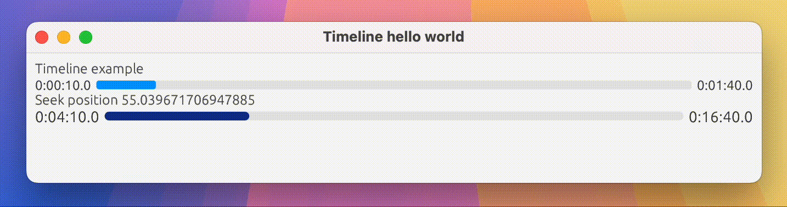

# egui-timeline

A customizable timeline widget for [egui](https://github.com/emilk/egui) designed for media applications. This widget provides an interactive timeline with seek functionality, perfect for video players or any application that needs to display and control media playback progress.



## Features

- **Interactive Seeking**: Click or drag to seek to any position in the timeline
- **Real-time Progress Display**: Shows current progress and total duration in HH:MM:SS format
- **Hover Tooltips**: Display precise time values when hovering over the timeline
- **Customizable Appearance**: Configure colors, height, corner radius, and font size
- **Media-Focused**: Uses seconds as the base unit, ideal for media applications

## Examples

Run the included example:

```bash
cargo run --example hello_world
```
